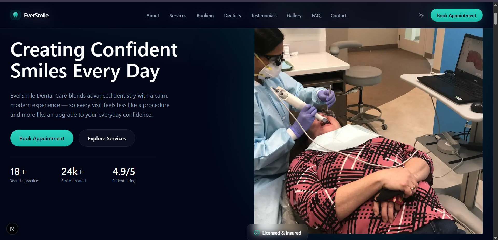

# 🦷 EverSmile Dental Care

A modern, responsive, and high-performance website for **EverSmile Dental Care**, built as part of a Web Developer Internship Assignment for **Limitless**.

The goal of this project was to create a professional local business website using modern web technologies while focusing on clean architecture, responsive design, accessibility, SEO, and performance.

---

# 📖 Project Overview

EverSmile Dental Care is a fictional premium dental clinic website designed to help patients easily learn about the clinic, explore available services, build trust through testimonials, and book appointments.

The project follows a component-based architecture using Next.js App Router and aims to deliver a fast, responsive, and user-friendly experience across all devices.

---

# ✨ Features

- Responsive design for mobile, tablet, and desktop
- Premium modern UI with dark theme
- Sticky navigation bar
- Smooth scrolling navigation
- Reusable React components
- Framer Motion animations
- SEO-friendly metadata
- Optimized images using Next.js Image
- Accessible semantic HTML
- Contact section with appointment CTA
- Clean folder structure
- Performance-focused implementation

---

# 🚀 Installation

Clone the repository:

```bash
git clone https://github.com/Atuba426/premium-dental-clinic-website
```

Navigate into the project:

```bash
cd premium-dental-clinic
```

Install dependencies:

```bash
npm install
```

Run the development server:

```bash
npm run dev
```

Open your browser:

```
http://localhost:3000
```

---

# 📁 Folder Structure

```
app/

├── api
├── about
├── booking
├──contact
├──dentist
├── layout.tsx
├── page.tsx
├── globals.css
│
components/
│
├── common/
    ├──ImagePlaceholder.tsx
    ├──NewsletterForm.tsx
    ├──Reveal.tsx
    ├──ThemeProvider.tsx
    ├──ThemeToggle.tsx
│   ├── Button.tsx
│   ├── Container.tsx
│   └── SectionHeader.tsx
│
├── layout/
│   ├── Navbar.tsx
│   └── Footer.tsx
│
└── sections/
    ├── Hero.tsx
    ├── About.tsx
    ├── Services.tsx
    ├── Doctors.tsx
    ├── Testimonials.tsx
    ├── Gallery.tsx
    ├── FAQ.tsx
    └── Contact.tsx

public/

```

This structure keeps reusable UI components separate from page sections, making the project easier to maintain and scale.

---

# 💻 Tech Stack

### Frontend

- Next.js 15 (App Router)
- React
- TypeScript
- Tailwind CSS
- Framer Motion

### Development Tools

- ESLint
- Git
- GitHub
- Vercel

---

# 📌 Assumptions

- This project represents a fictional dental clinic.
- Appointment booking is demonstrated as a front-end interface only.
- Images and branding are used for demonstration purposes.
- Backend functionality such as database storage, authentication, and appointment management is outside the scope of this assignment.

---

# 🔮 Future Improvements

If more development time were available, the following features could be added:


- Admin dashboard
- Patient authentication
- Appointment management
- CMS for managing services and doctors
- Blog section
- Multi-language support

---

# ⚠️ Known Limitations

- Doctor profiles use placeholder data
- Gallery uses static images
- Testimonials are static
- No authentication or user accounts

These limitations were intentionally accepted because its not the Real project.

---

# 📷 Screenshots

## Home Page




```

## Services Section

/screenshots/services-section.png
```


# 🌐 Live Demo

Vercel Deployment:

https://premium-dental-clinic-website-nine.vercel.app/

---

# 👩‍💻 Developer

**Ayesha Tuba**

Built as part of the Web Developer Internship Assignment for **Limitless**.